# DAT250 Experiment 3 MONGODB

Technical problems: None.

Screenshot Validation:
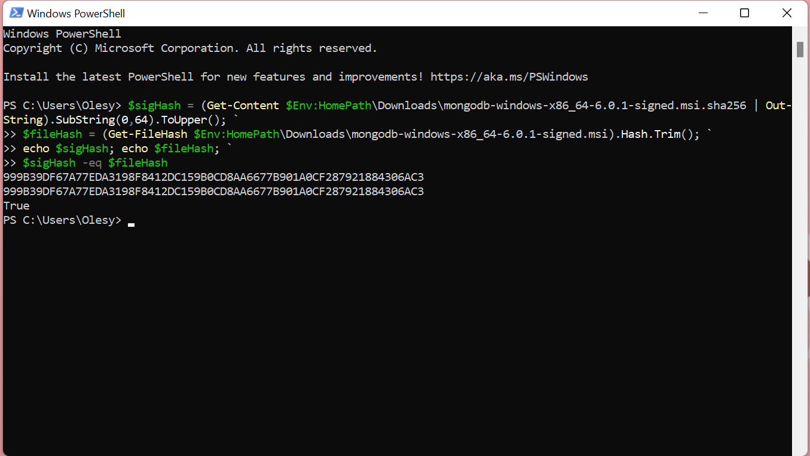

#### Screenshot Experiment 1:
Insert documents:

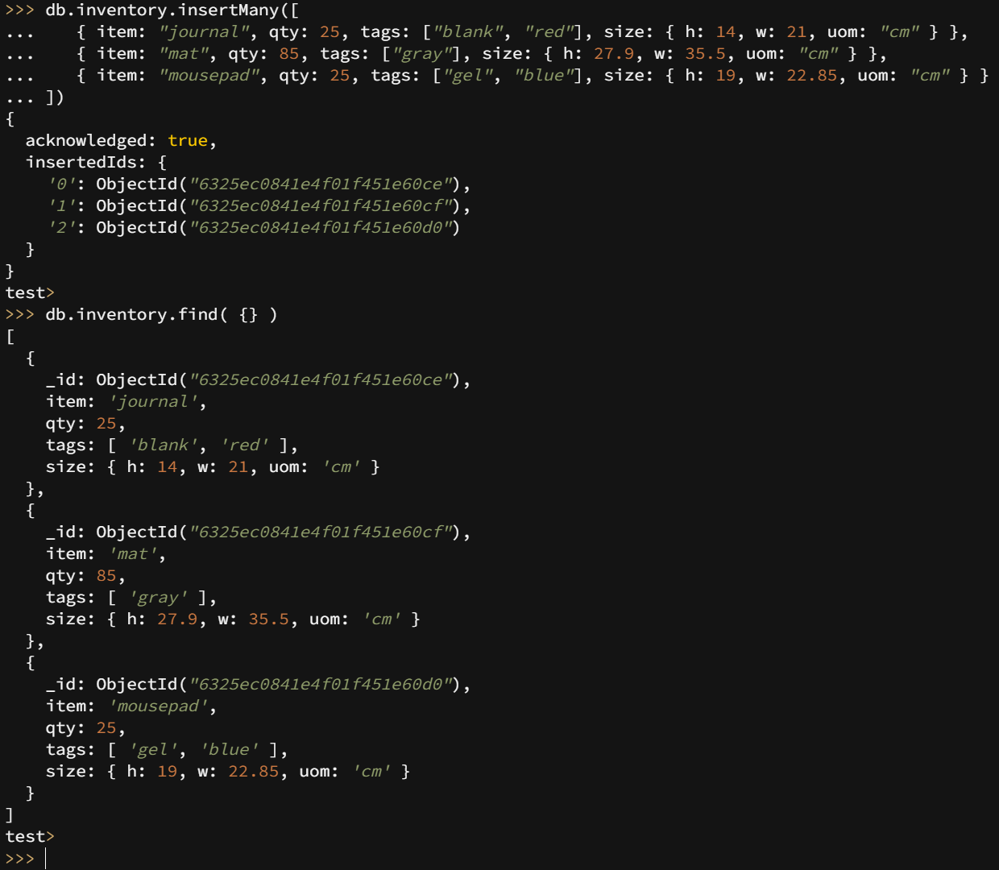

Query documents:

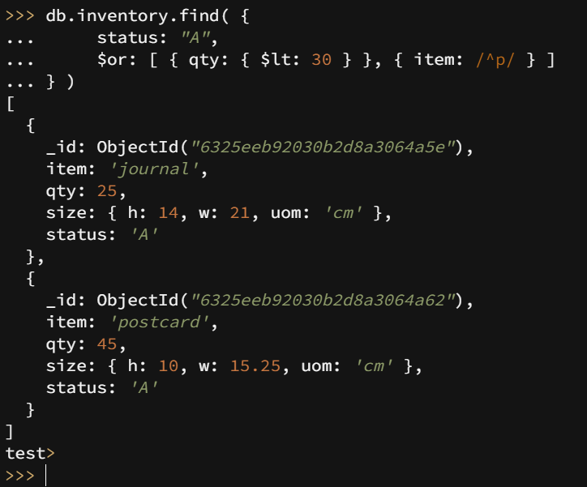

Update documents:

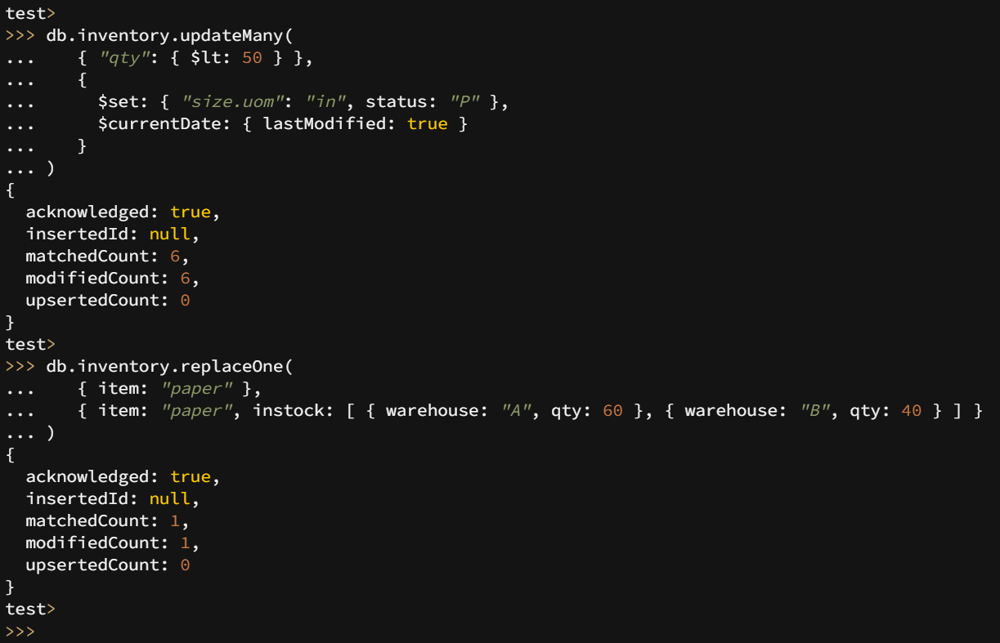

Remove documents:

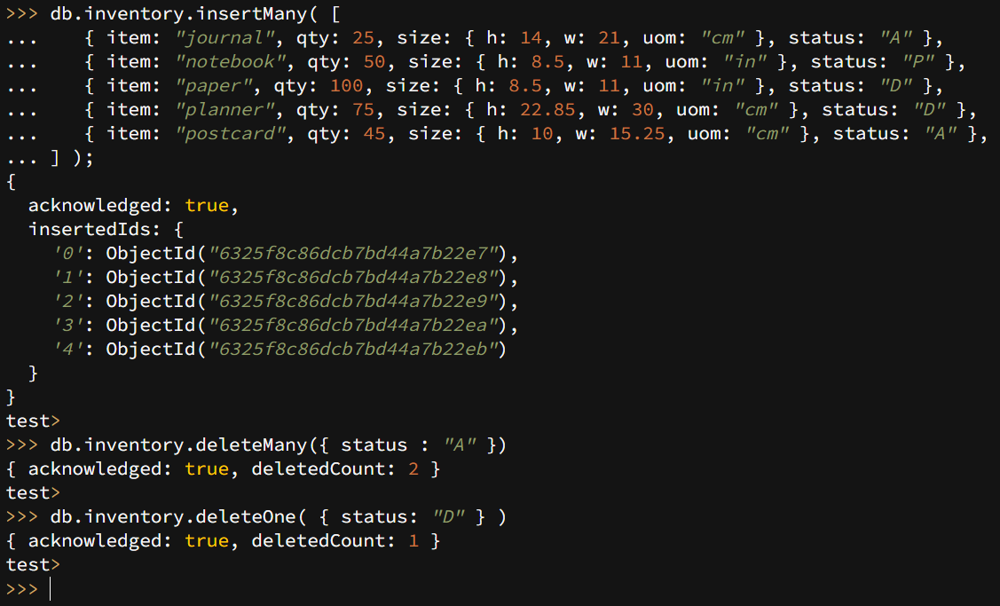

Bulk write operations:

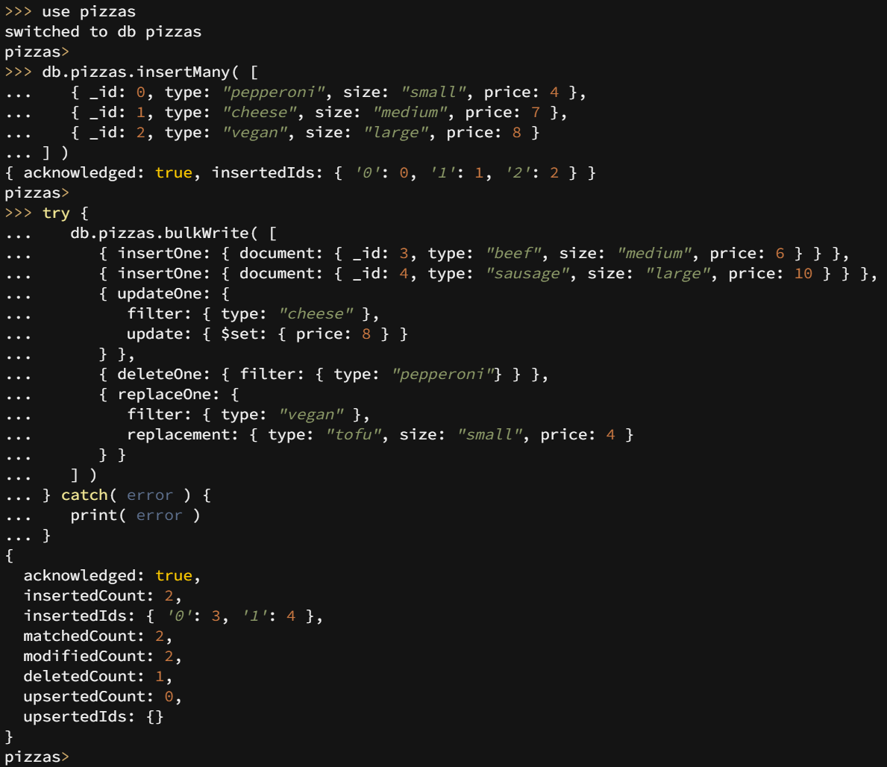

#### Screenshot Experiment 2:

Example 1:

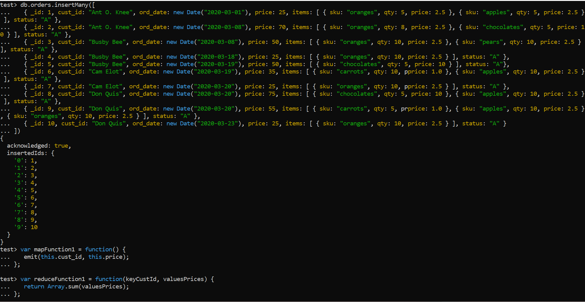
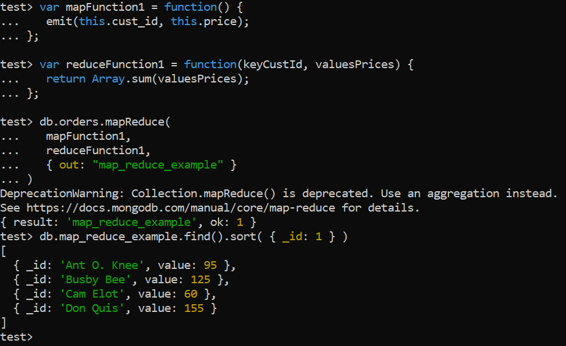

Example 2:

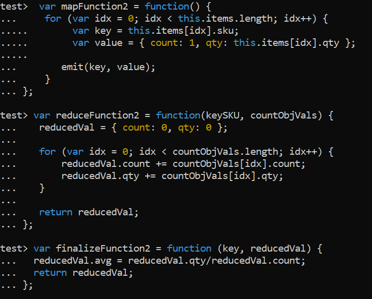
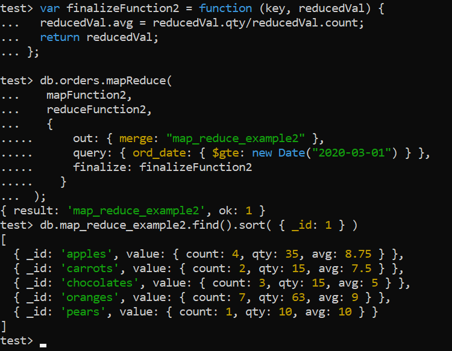

My own implementation:

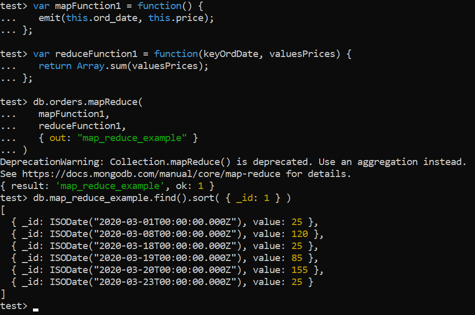

Reason about why my implemented 
Map-reduce operation in Experiment 2 is useful
and interpret the collection obtained:

I believe my implemented Map-reduce operation is useful
because it shows how much they sold for the days they had 
customers. So their total sum per day. From the result
we can see that they sold for the most money on March 20th 2020.

Pending issues: None.